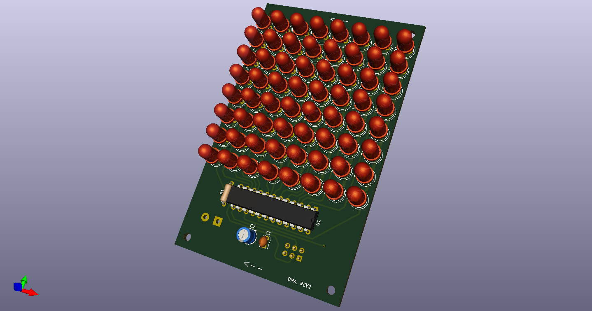

# LED Matrix 7219

## Introduction
The LED Matrix 7219 is a serial controlled 8x8 display using individual LED's. Displays can be cascadable up to 8 modules and you can use any
through hole LED's. Pitch between LED's is 7.62mm(0.3"). The Matrix is wired up to match the FC-16 type modules and is standard Arduino code is compatible.

## Bill of Materials
Reference | Description                         | Part No.  
----------|-------------------------------------|----------------
D1-D64    | 5mm LED, Diffused                   | (Red)LTL2R3KRD-EM (Yellow)LTL2R3KYD-EM (Green)LTL2R3KGD-EM
U1        | LED Display Driver IC, PDIP-24      | MAX7219CNG+
R1        | 30KOhm, 1/4W, Resistor              | CFR-25JB-52-30K
C1        | 0.1uF, 50v, MLCC                    | K104K15X7RF5TL2
C2        | 10uF, 25V, Elec Capacitor           | ECE-A1EKS100I
J1        | Terminal block, 2 pos, 5.08mm       | TB007-508-02BE
J2        | Pin Header, 6 pos, 2 row, Straight  | 67996-106HLF
Misc      | Wire Housing, 6 pos, 2 row          | M20-1070300
Misc      | Crimp, 30 AWG to 22 AWG             | M20-1160042

NOTE: R1= Iset Value, Example given 1.5Vf at 20mA. See MAX7219 datasheet for full table.

## Changes
* Revision 2.0
  * Complete board redesign
  * Fixed LED origin point 
  * Added extra bypass capacitors for U1

* Revision 1.0
  * Initial version
  
  
## Links

[FC-16 wiring info](https://majicdesigns.github.io/MD_MAX72XX/page_f_c16.html)

[Arduino Library](https://reference.arduino.cc/reference/en/libraries/md_max72xx/)

